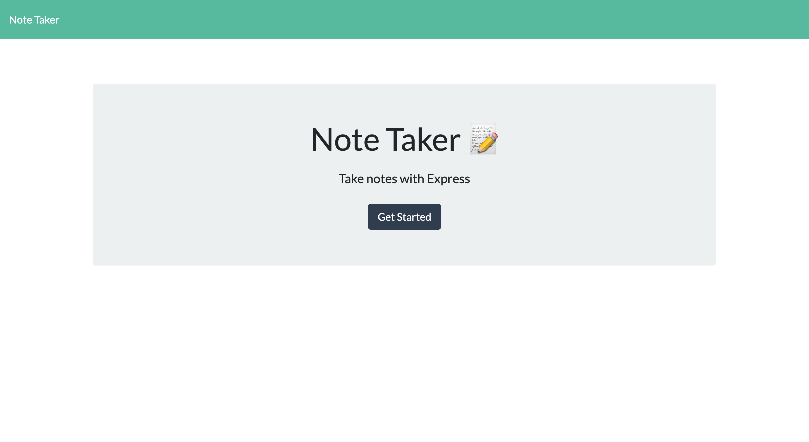
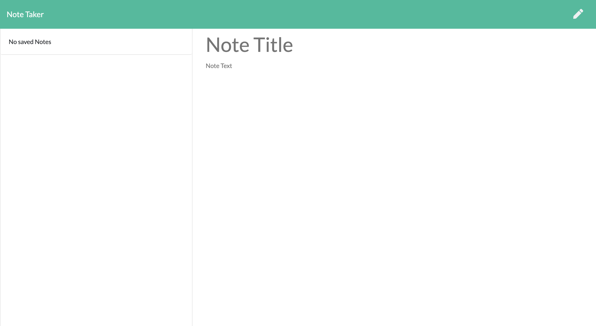

## Taker-of-the-Notes
    
    
## Description
Have you ever lost a paper note, or forgotten about something you had to do? Well I have a solution for you, with this application  you can create, save and delete notes all in one page and without ever forgetting again.
 
## Table of Contents
* [Installation](#installation)
* [Usage](#usage)
* [License](#license)
* [Test](#test)
* [Contributors](#contributors)
* [Questions](#questions)

## Link to deployed website

https://taker-of-the-notes.herokuapp.com/

## Deployed website

## Installation
you will need vs code, npm init, and express pacakge

## Usage
to create, save and delete notes  

## License
Lincenses used: MIT

## Test
VS code, run npm init, node, and install express dependency

## Contributors
Jose Morales

## Questions

GitHub: https://github.com/jmoarles072095

Contact Me: jmorales072095@gmail.com
    